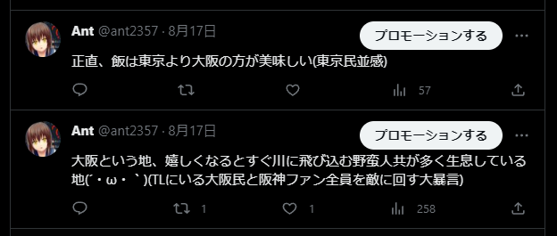
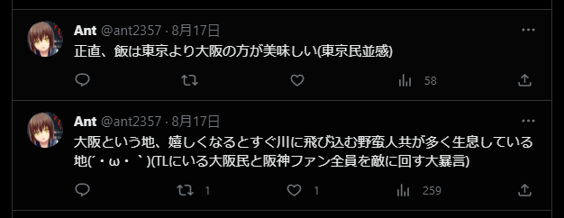

# x-hide-promotion-button
X(旧Twitter)にて、プロモーションするボタンを非表示にする Chrome拡張です。

## Example

### Before


### After


## Usage

* 当プロジェクトをローカルに落とします。
```bash
git clone https://github.com/Ant2357/x-hide-promotion-button.git
```

* Chrome を開き 「拡張機能を管理」 -> 「パッケージ化されていない拡張機能を読み込む」から当プロジェクトを選択。

* これで導入完了です。
